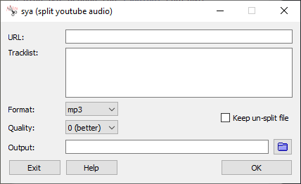

# sya

**sya - split youtube audio**, download, convert & split audio from youtube videos into multiple audio tracks using 'yt-dlp' and 'ffmpeg'.

---

## sya.py

This is the base Python script, which contains all the functionality:

	sya.py [OPTIONS] TRACKLIST

### OPTIONS

```
  -h, --help
    show this help message and exit
  
  -o [PATH], --output [PATH]
    specify the directory to write output files to (default: ./out)
						
  -f [FORMAT], --format [FORMAT]
    specify the --audio-format argument to pass to yt-dlp (default: mp3)
	
  -q [QUALITY], --quality [QUALITY]
    specify the --audio-quality argument to pass to yt-dlp (default: 320K)

  --yt-dlp [PATH]
    path of the "yt-dlp" binary to use
	
  --ffmpeg [PATH]
    path of the "ffmpeg" binary to use
	
  -k, --keep
    keep any files removed during processing (full video/audio file)
```

### TRACKLIST

**TRACKLIST** should be the filepath of a UTF-8 text file that has the URL of the video to download to audio track of on line 1.
Every line after this should be the track name and timestamp of each track, note that the timestamp is *where the track starts*.

Regex is used to parse the tracks (timestamp and name), it tries to be fairly accomodating but isn't perfect - so here are a few rules:

- Timestamps can be before or after the track name.
- Timestamps can be wrapped in `[]` or `()`.
- Timestamps can be `MM:SS` or `HH:MM:SS`.
- Timestamps can be split using `:` or `.`.

<details>
	<summary>Example Tracklist</summary>
	<pre>
	https://www.youtube.com/watch?v=LbjcaMAhJRQ
	Sneaky Snitch (0:00)
	Fluffing a Duck (2:16)
	Cipher (3:24)
	Scheming Weasel (7:15)
	Carefree (8:44)
	Thatched Villagers (12:09)
	Monkeys Spinning Monkeys (16:15)
	Wallpaper (18:20)
	Pixel Peeker Polka (21:59)
	Killing Time (25:21)
	Hitman (28:46)
	The Cannery (32:07)
	Cut and Run (35:09)
	Life of Riley (38:44)
	Quirky Dog (42:39)
	The Complex (45:08)
	Hyperfun (49:35)
	Black Vortex (53:29)
	Rock on Chicago (56:19)
	Volatile Reaction (57:58)
	On the Ground (1:00:44)
	Wagon Wheel (electronic) (1:03:23)
	Call to Adventure (1:08:26)
	Hustle (1:12:33)
	Cupids Revenge (1:14:34)
	Dirt Rhodes (1:16:20)
	Rhinoceros (1:18:20)
	Who Likes to Party (1:21:43)
	Spazzmatica Polka (1:26:01)
	</pre>
</details>

### Install

It's a Python script, so there are many ways to install it.

Here's one that should work on *any* system:

	python3 ./setup.py install --user --record install.txt

To **uninstall**, just remove all files recorded to *./install.txt*.

---

## sya-pyqt

Some people don't like the cli and I wanted to play with PyQt, so sya-pyqt wraps a nice GUI around the *sya.py* runtime.



### Development

Working on or building requires *PyQt5*, this can be installed with `pip install PyQt5`.

To run *sya-pyqt*, you don't need to build a binary everytime, you can just run `python ./sya-pyqt.py`.

### Building

[pyinstaller](https://pyinstaller.org) is used to build a portable binary for sya-pyqt for easy distribution.

**POSIX (Linux, MacOS, BSD)**

	FFMPEG="<filepath to ffmpeg>" \
	YTDLP="<filepath to yt-dlp>" \
	pyinstaller ./src/sya-pyqt.py -F --windowed --add-data "./doc/HELP.md:." --add-data "./res/folder.png:." --add-data "./res/file.png:." --add-data "./res/sya.png:." --add-data "$FFMPEG:." --add-data "$YTDLP:."

**Windows**

	$FFMPEG="<filepath to ffmpeg.exe>"
	$YT_DLP="<filepath to yt-dlp.exe>"
	pyinstaller .\src\sya-pyqt.py -F --windowed --add-data ".\doc\HELP.md;." --add-data ".\res\folder.png;." --add-data ".\res\file.png;." --add-data ".\res\sya.png;." --add-data "$FFMPEG;." --add-data "$YT_DLP;."


**IMPORTANT NOTES**

- Make sure you have the latest *yt-dlp* binary available, the filepath to this should replace *$YT-DLP*.
- Make sure you have the latest *ffmpeg* binary available, the filepath of this should replace *$FFMPEG*.
- In some cases, I've found the path of PyQt5 has had to be explicitly given to *pyinstaller*:
`--path <site-packages filepath>\PyQt5`
- You might want to add an icon to the binary, to do this install [Pillow](https://python-pillow.org/) and add `--icon "sya.png"` to the build command.


---

## Thanks

These two tools do all the heavy lifting:
- youtube-dl (https://ytdl-org.github.io/youtube-dl/)
- ffmpeg (https://ffmpeg.org)

And the cool folder & file icons used in 'sya-pyqt' are from the Palemoon MicroMoon theme: 
https://repo.palemoon.org/Lootyhoof/micromoon


## Disclaimer

It should go without saying, don't use this for pirating music. Get nice high-quality, properly tagged audio tracks from official services (shoutout to Bandcamp).
The tool was originally written to download radio mixes and ambient soundtracks for a DnD group.

## Authors

- gearsix
